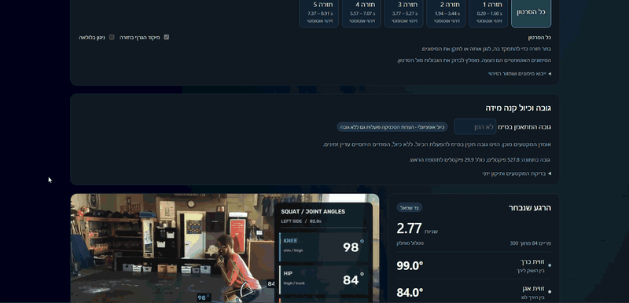
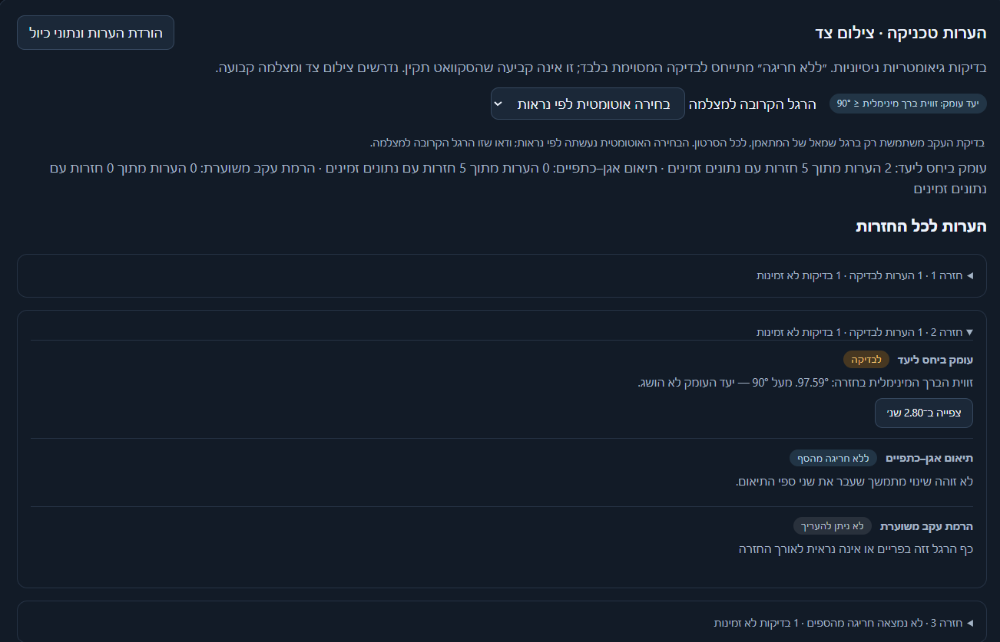

<div align="center">

# 🏋️ GymBromatics

**Side-view squat analysis from a phone video, with no model training.**<br>
Pose estimation + signal processing + biomechanics heuristics → annotated video and an interactive rep-by-rep dashboard.

[](https://github.com/Itaymizik/GymBromatics/actions/workflows/ci.yml)


[**Live demo**](https://gymbromatics-staging-314205128886.me-west1.run.app) · [Docs](docs/) · [Sample sessions](demo_artifacts/)



</div>

## ✨ What it does

| | |
|---|---|
| 🦴 **Pose tracking** | 33 BlazePose landmarks per frame, confidence-gated and gap-aware |
| 📐 **Joint angles** | Live knee / hip / ankle interior-angle arcs drawn on the video |
| 📈 **Velocity profile** | Savitzky–Golay-smoothed vertical chest velocity; click the chart to seek the video |
| 🔁 **Rep detection** | Automatic squat-cycle proposals with a draggable boundary editor |
| 🩺 **Technique notes** | Depth (knee ≤ 90°), hip-first rise and heel lift, each linked to evidence frames |
| 📊 **Rep comparisons** | Duration, depth, pause and velocity compared against the previous rep and the session median |
| 💬 **AI coach** *(optional)* | Hebrew feedback and chat from Gemini Free Tier, based only on computed metrics |

<table>
  <tr>
    <td width="50%"></td>
    <td width="50%"></td>
  </tr>
  <tr>
    <td align="center"><sub>Synchronized video, angles and velocity</sub></td>
    <td align="center"><sub>Per-rep technique notes with evidence</sub></td>
  </tr>
  <tr>
    <td width="50%"></td>
    <td width="50%"></td>
  </tr>
  <tr>
    <td align="center"><sub>Session summary</sub></td>
    <td align="center"><sub>Ask questions about the session</sub></td>
  </tr>
</table>

<sub>The dashboard UI is in Hebrew.</sub>

## 🚀 Quick start

```bash
python -m venv .venv
source .venv/bin/activate            # Windows: .venv\Scripts\activate
pip install -r requirements-dev.txt
python -m gymbromatics path/to/squat.mp4 --download-model --dashboard
```

Then open `outputs/squat_dashboard.html` in a browser. It is a single self-contained file that works offline.

**Or run the server with Docker:** `docker compose up --build` → <http://127.0.0.1:8765>

> 📹 **Filming tips:** side view (90°), static camera, one lifter, whole body in frame.

## 🧠 How it works

```
 video ──► extractor.py ──► filter.py ──► squat_logic.py ──► visualizer.py ──► annotated MP4
          (MediaPipe pose)  (smoothing,   repetitions.py     dashboard.py  ──► interactive HTML
                             velocity)    technique / comparisons           └─► optional Gemini feedback
```

The pose layer sits behind a provider-independent `PoseExtractor` interface, so MediaPipe can be swapped for another pose model (e.g. YOLO-Pose) without touching the kinematics code.

## 📚 Documentation

| Topic | |
|---|---|
| [Usage & CLI](docs/usage.md) | Setup, options, outputs, Docker, CI |
| [Architecture](docs/architecture.md) | Modules and landmark data contract |
| [Joint angles](docs/joint-angles.md) | Angle definitions and JSON schema v3 |
| [Dashboard](docs/dashboard.md) | Velocity profile, rep detection and editing |
| [Technique rules](docs/technique-rules.md) | Depth / coordination / heel-lift rules, height calibration |
| [Rep comparisons](docs/comparisons.md) | Per-rep metrics, deltas and session trends |
| [LLM feedback & chat](docs/llm-feedback.md) | Gemini Free Tier setup, privacy, API |
| [Testing](docs/testing.md) | Unit, integration and browser tests |

## ⚠️ Limitations

These are 2D side-view estimates. Velocities are in **px/s, not m/s**, and every threshold is an experimental proof-of-concept heuristic, not a clinical or competition judgement.
