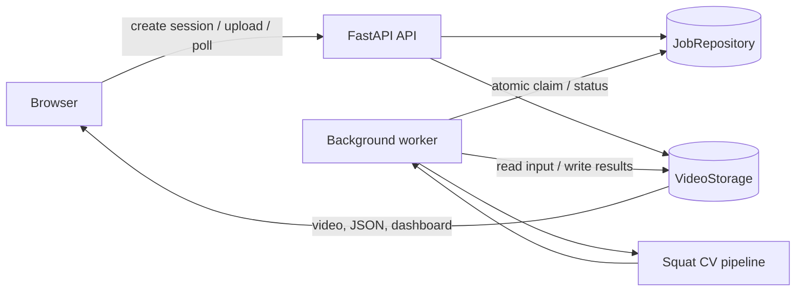
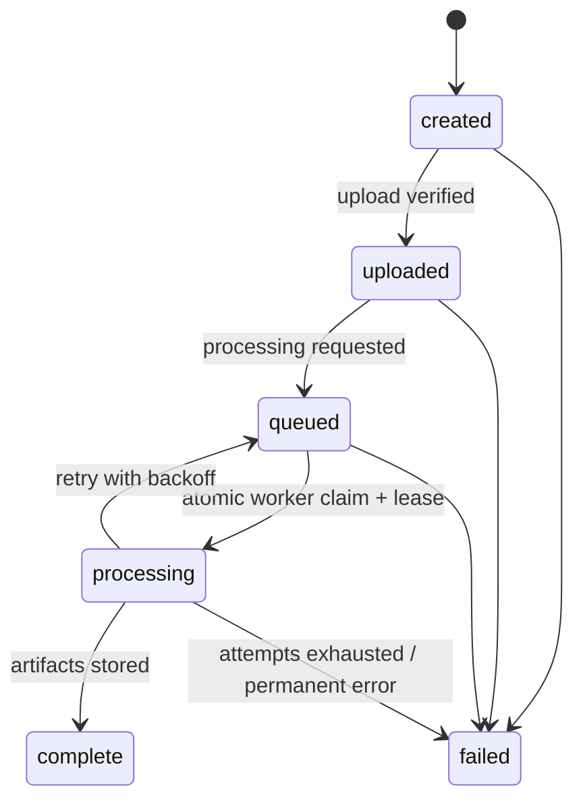

# System architecture and data contract

[← Back to README](../README.md)

## System overview



`api.py` owns the HTTP boundary: it validates session requests, receives local
uploads, queues work, exposes status, and serves completed artifacts. It does not
run MediaPipe. `worker.py` runs as a separate process, atomically claims queued
jobs, downloads their video, executes the CV pipeline, stores the generated files,
and records either completion or a controlled retry/failure.

Persistence is hidden behind the `JobRepository` and `VideoStorage` protocols.
The local adapters use JSON records and files under one shared directory. Docker
Compose mounts that directory as a named volume in both containers. In a cloud
environment, `GCSVideoStorage` replaces the file adapter and gives the browser a
short-lived V4 Signed URL, so large video bytes bypass FastAPI. `JobRepository`
remains the replacement point for a managed database or queue.

## Job lifecycle



`jobs.py` defines this state machine and immutable `ProcessingJob` records. The
repository uses a file lock, atomic replacement, and record versions to prevent
two workers from claiming or overwriting the same job. A processing lease and
timeout let another worker recover abandoned work; transient errors return to
`queued` with backoff until the attempt limit is reached.

## Application and infrastructure modules

- `api.py`: FastAPI routes for sessions, uploads, status, results, health and chat.
- `jobs.py`: processing-job model, valid transitions, attempts and leases.
- `job_repository.py`: `JobRepository` protocol and atomic local JSON adapter.
- `storage.py`: `VideoStorage` protocol plus local filesystem and GCS adapters.
- `worker.py`: queue polling, atomic claim, timeout, retry and pipeline execution.
- `docker-compose.yml`: separate API and worker containers with a shared named volume.
- `chat.py` / `chat_server.py` / `chat_ui.js`: session-aware Hebrew chat over computed evidence.

## Computer-vision pipeline

```text
video → extractor → filter → squat logic → repetitions / technique / comparisons
      → visualizer + JSON → dashboard → optional LLM feedback
```

- `state.py`: provider-independent `Landmark` and `FrameState` dataclasses.
- `extractor.py`: `PoseExtractor` interface and the MediaPipe video adapter.
- `filter.py`: gap-aware trajectory smoothing and vertical velocity calculation.
- `squat_logic.py`: bilateral 2D joint angles, confidence gating and display-side selection.
- `repetitions.py`: automatic squat-cycle proposals from the hip trajectory.
- `technique.py`: geometry-based technique rules and height calibration.
- `comparisons.py`: per-repetition comparisons.
- `visualizer.py`: OpenCV overlays using named landmarks, without MediaPipe types.
- `pipeline.py`: video I/O, timestamps, JSON streaming and resource cleanup.
- `dashboard.py`: portable interactive video, velocity, angle and repetition report.
- `feedback.py` / `feedback_provider.py`: optional Gemini feedback from computed evidence.

The pose layer is isolated behind `PoseExtractor`, so MediaPipe can be replaced
by another provider without changing the kinematics engine. The application layer
depends on the storage and repository protocols, so infrastructure can likewise
change without rewriting the CV pipeline.

## Landmark data contract

Coordinates are normalized image `x`, `y` and relative-depth `z`, with confidence
values `visibility` and `presence`. Y increases downwards; z is **not** a calibrated
distance in metres. Left/right names refer to the subject's anatomy. Hip, knee,
ankle and wrist landmarks are available by name for squat analysis.

Missing detections produce `pose_detected: false` and `landmarks: {}`. The frame
is still written. Low-confidence landmarks remain in JSON, but points and limbs
are drawn only when both visibility and presence meet the threshold. Downstream
analysis must use the same reliability check or interpolate gaps before analysis.
