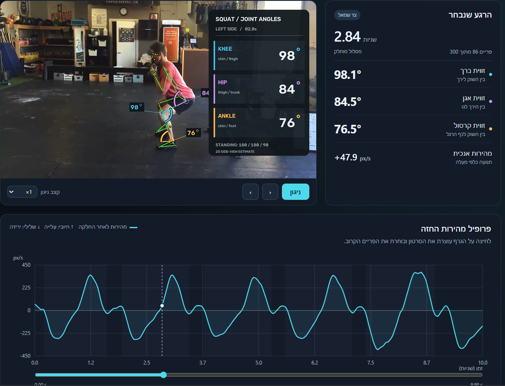
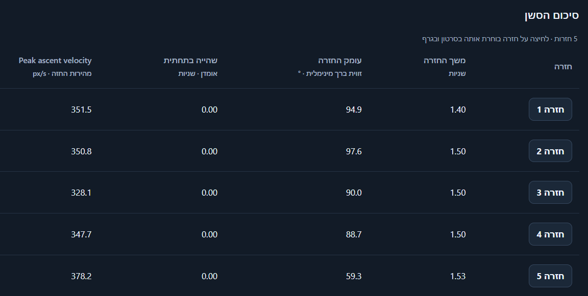

# Interactive dashboard and repetition editing

[← Back to README](../README.md)



## Chest-velocity dashboard

Open `outputs/squatsample_dashboard.html` directly in a browser. It is a portable
offline report: the chart data and an H.264 copy of the annotated video are
embedded, so no server, CDN, upload or internet connection is needed.
The dashboard UI is in Hebrew.

- Click the velocity chart to pause and seek to the nearest frame. The panel
  displays its knee, hip and ankle **interior angles**, selected anatomical side,
  timestamp and vertical velocity.
- Use the time slider (including keyboard arrows), frame-step buttons or video
  playback; the selection marker and measurements stay synchronized.
- Hover/touch the graph for time/velocity and download the profile as JSON.
- Missing velocity or angles are shown as unavailable, never as zero.

Generate it from the existing analysis without running MediaPipe again:

```powershell
.\.venv\Scripts\python.exe -m gymbromatics.dashboard outputs/squatsample_landmarks.json --video outputs/squatsample_skeleton.mp4 --output outputs/squatsample_dashboard.html
```

Or include it with a new video processing run:

```powershell
.\.venv\Scripts\python.exe -m gymbromatics data/squatsample.mp4 --dashboard
```

The chest location is approximated by the **midpoint of both shoulders**.
The profile measures **vertical velocity in pixels/second**: positive upward,
negative downward. It is not total 2D speed, bar speed or calibrated metres/second.
Frame times use `frame_index / fps`. A quadratic Savitzky–Golay filter smooths
the Y trajectory with an odd window of approximately 0.35 seconds; only then is
the smoothed trajectory differentiated. The actual window is recorded in JSON.
Both shoulders must pass confidence checks. Bounded gaps up to 0.15 seconds are
interpolated and flagged, longer gaps remain gaps. Contiguous segments shorter
than five frames have no velocity. Segment edges have less smoothing support.
The camera should remain stationary; perspective and camera motion affect the
measurement. Joint angles stay attached to their original frame and are not
interpolated with the chest trajectory.

`outputs/squatsample_dashboard.json` contains the profile, processing parameters,
raw/smoothed chest Y, interpolation flags, frame indices and linked angles.
The original analysis JSON and annotated MP4 remain unchanged by report export.

## Repetition selection and editing



The dashboard proposes complete squat cycles automatically. Select a repetition
chip to seek to its start and focus the chart. Turn off chart focus to retain
the full timeline. Playback stops at the selected end, or repeats that interval
when the loop checkbox is enabled. Choosing "all video" removes this restriction.

Open the boundary editor to adjust start, bottom and end with labeled sliders,
keyboard arrows, or the "use displayed frame" buttons. The three markers above
the chart are also draggable and keyboard accessible. Start must precede bottom,
bottom must precede end, and repetitions cannot overlap (a shared endpoint is OK).
Use "add repetition" to mark three frames in sequence; delete erroneous proposals
or undo changes with the corresponding buttons. Automatic, edited and manual
repetitions are labeled separately.

Edits are saved in local browser storage under a SHA-256 identity of the exact
analysis. Local-file storage support varies by browser: if saving fails, the
dashboard reports it. Export the repetition JSON for durable backup or transfer;
import validates the analysis identity, integer frame bounds, order and overlaps.
Reopening the same file in the same browser restores saved edits. Moving the
HTML or using a different browser may require importing the exported file.
Exported timestamps use frame index / FPS; frame indices are zero-based. Displayed
frame labels are one-based. The original Python analysis files are not modified
by browser edits. Undo supports the current session; restoring automatic proposals
can itself be undone.

### Automatic detection

Automatic detection uses the confidence-gated hip on the already-selected body
side, smoothed with the same gap-aware filter. Local maxima in image Y locate
the bottom. Minimum prominence is the larger of 3.5% of image height and 25% of
the segment's robust excursion. Bounds return within 8% of excursion (minimum
2 pixels) of each adjacent standing valley, avoiding merged reps when standing
height drifts during the set. Available knee angles validate
near-upright endpoints (at least 170 degrees) and at least 20 degrees of flexion.
Hip speed at endpoints must be below 15% of the segment's 95th-percentile speed
(with a 5 px/s floor), so the interval includes deceleration into standing.
Cycles must last at least 0.6 seconds. Long gaps and incomplete cycles at the
video edges are excluded, and interpolated or missing knee data flag a proposal
for review. These thresholds are POC heuristics, not a depth or lift-validity
assessment; manually adjust unusual tempos, camera movement and partial reps.
