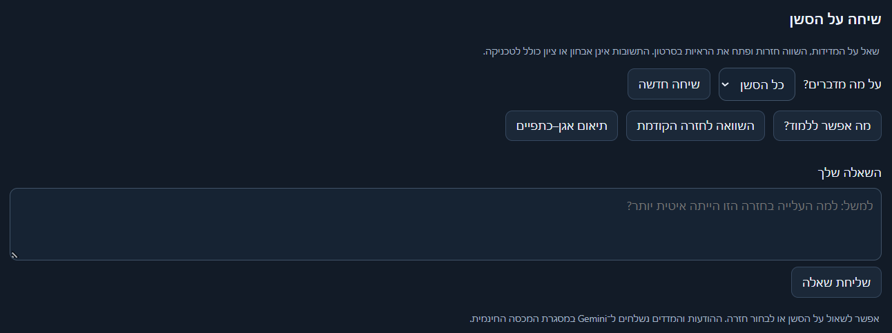

# Optional Hebrew LLM feedback and session chat

[← Back to README](../README.md)

## Gemini Free Tier setup

The feedback stage is separate from extraction and deterministic kinematics.
It uses `gemini-3.5-flash-lite` via Google's REST API, with no added Python
dependency. The model has a free tier; **the API key's project must actually be
Free Tier with billing disabled**. A model name or API key alone cannot verify
the billing tier. This application requires explicit local confirmation, does
not enable billing, never switches to another provider/model, and makes one
request per uncached session. On quota exhaustion it stops without retries.
Check current [pricing](https://ai.google.dev/gemini-api/docs/pricing) and
[billing](https://ai.google.dev/gemini-api/docs/billing) in Google AI Studio.
Free-tier inputs/outputs may be used by Google to improve its products.

Create a key for a Free Tier project at <https://aistudio.google.com/api-keys>.
Create the ignored `.env.local` file in the project root using `.env.example`:

```dotenv
GEMINI_API_KEY=your_key_here
GEMINI_FREE_TIER_CONFIRMED=true
```

Set the second value only after verifying the project has no billing enabled.
Never paste a real key into chat, a command line, HTML, exported session data
or source control. Existing environment variables take precedence over the
file. The file parser only reads these two names and does not execute contents.

## Session feedback

Run on the existing sessions without reprocessing their videos:

```powershell
.\.venv\Scripts\python.exe -m gymbromatics.feedback outputs/squatsample_dashboard.json
.\.venv\Scripts\python.exe -m gymbromatics.feedback outputs/squat_test2_dashboard.json
```

For a new video, append `--feedback` to the existing pipeline command:

```powershell
.\.venv\Scripts\python.exe -m gymbromatics data/squatsample.mp4 --dashboard --feedback
```

The standalone dashboard export command also supports `--feedback`.
Use `--feedback-prepare-only` on either pipeline command, or `--prepare-only`
with `gymbromatics.feedback`, to build the input without credentials/network.
The standalone command accepts either dashboard/session JSON or schema-v3
landmark JSON, an optional `--env-file`, and `--foot-side left|right` to override
automatic near-foot selection. To use browser-edited repetitions, download the
full session JSON and run feedback on that file. Browser-only calibration/foot
preferences are not read automatically; velocities remain px/s.

Outputs are `<session>_feedback_input.json` (the numeric evidence sent to the
model) and `<session>_feedback.json` (status, provenance, evidence, Hebrew session
summary, per-repetition observations, and next steps). These are sidecar files;
the dashboard display and original analysis are unchanged. Status `prepared`
means no LLM call was made and `feedback` is null. `unavailable` includes a safe
error code such as `missing_api_key`, `free_tier_not_confirmed`, `quota_exceeded`,
or `invalid_feedback`; it never pretends that a fallback is model feedback.
The standalone CLI returns exit code 2 for unavailable feedback. The video and
dashboard pipelines retain their artifacts and report the feedback status.

### What is sent

The cloud receives anonymous rep IDs and computed scalar metrics/comparisons,
geometry-rule results, coverage, and limitations. No video, frames, coordinate
trajectories, filenames, user height, credentials, or original IDs are sent.
`technique_report.cjs` reuses the existing dashboard geometry rules through
Node.js; without Node or geometry, those rules are explicitly unavailable while
the other measurements remain usable. Comparisons are always recomputed from
current boundaries. Local output maps anonymous IDs back to original rep IDs.

### Validation

Structured responses cite evidence IDs for each statement. Validation checks
evidence membership locally instead of embedding long repeated enum lists in
the API schema (which can cause Gemini to reject a request). Validation checks
structure, actual references, rep association, Hebrew text, and absence of
numeric digits in prose; exact values remain in the attached evidence. It does
**not** prove semantic correctness. Prompts prohibit inferring fatigue, injury,
knee valgus, barbell speed, or medical conclusions. Technique `clear` only means
the configured heuristic did not trigger, and `review` remains a flag to inspect.
The rule of knee angle <=90 degrees is not represented as a validated parallel
test. Feedback is limited to 30 reps / 100 KB of evidence per request.

Successful feedback is reused only when the analysis identity, current input,
boundaries, foot choice, prompt/schema and model match. Manually edited session
data therefore invalidate the cache. No cloud calls occur during normal tests.

## Session chat in the dashboard



Start the local server from the project root (using the same `.env.local`):

```powershell
.\.venv\Scripts\python.exe -m gymbromatics.chat_server
```

Open <http://127.0.0.1:8765> and choose a session. The chat panel is above the
session statistics. Select a repetition in either the dashboard or the chat
selector, enter a question in Hebrew, and send. Evidence cards show computed
values and buttons seek the video to a repetition or measured event. Suggested
questions fill the text box without sending a request. Opening standalone HTML
still supports all offline analysis; chat requires the local server.

### API

The development command starts a FastAPI application through Uvicorn. Its
interactive API documentation is available at <http://127.0.0.1:8765/docs>.
`GET /health/live` checks that the process can answer requests, while
`GET /health/ready` also checks that demo sessions and Gemini configuration are
available. Dashboards are served at `GET /sessions/{analysis_id}` and chat uses
`POST /sessions/{analysis_id}/chat` with Pydantic-validated input.

`--port 8766` selects a different port; `--dashboards <file.html> ...` registers
other exported dashboards with their matching session JSON. The server binds
only to loopback and serves only the registered pages, never a project directory.
The API requires the local Origin/Host and a page token; the Gemini key remains
in Python. A page token is not the API key. This is a local single-user tool,
not an authenticated multi-user production deployment.

### Requests, privacy and history

Each message makes at most one Gemini call; the client never automatically
retries. The server allows one generation at a time. The server sends the
question, anonymous selected-repetition ID, last four exchanges, and current
evidence/definitions. It does not send the video or coordinate trajectories.
Chat content is sent to Google's free tier, under that tier's data-use terms.
No paid fallback is used. Quota, key, validation and network failures appear in
the panel without fabricated answers.

History is kept only in server memory, scoped to a conversation and analysis.
Reloading the page or choosing New conversation starts a fresh conversation;
stopping the server clears history. Edited boundaries or near-foot selection
recompute evidence and invalidate old links/history, including edits made while
a request is in flight. Per-turn selection is preserved in conversational context.
The server resolves all timestamps and links; the model cannot invent video URLs.
Schema/reference validation is not a proof of semantic correctness.
