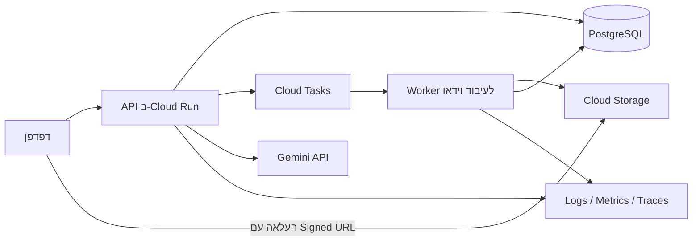

# GymBromatics — Production Learning Work Plan

## מטרת התוכנית

מטרת הפרויקט אינה להפוך בשלב זה למוצר מסחרי מלא, אלא לשמש פרויקט פורטפוליו שמדגים עבודה מקצה לקצה בסביבת production: תכנון API, אריזה ופריסה, עיבוד אסינכרוני, אבטחה, ניהול נתונים, CI/CD, תצפיתיות והערכת איכות של שכבת LLM.

העיקרון המנחה הוא לבנות מערכת קטנה אך אמינה, ניתנת לבדיקה ולתפעול. אין צורך לתמוך בעומס גדול או להוסיף יכולות שאינן תורמות ללמידה ולהדגמה.

## מצב נוכחי

- עיבוד סרטוני סקוואט מצילום צד באמצעות MediaPipe ו־OpenCV.
- הפרדה בין חילוץ pose, עיבוד אותות, לוגיקת קינמטיקה ורינדור.
- זיהוי חזרות, זוויות מפרקים, מהירות חזה, זמני ירידה ועלייה וסטטיסטיקות סשן.
- כללי טכניקה גיאומטריים לעומק, תיאום אגן–כתפיים והרמת עקב.
- דשבורד HTML אינטראקטיבי עם עריכת גבולות חזרות.
- השוואות מחושבות בין חזרות.
- פידבק מבוסס Gemini עם evidence IDs.
- צ'ט מקומי על הסשן והחזרה הנבחרת.
- בדיקות unit, integration ו־browser לחלקים המרכזיים.

## ארכיטקטורת היעד

Google Cloud הוא ספק היעד המועדף לתרגיל זה משום שהפרויקט כבר משתמש ב־Gemini. הארכיטקטורה עצמה אינה תלויה מהותית בספק וניתן להעבירה בעתיד ל־AWS או Azure.

## עקרונות עבודה

- לשמור על ההפרדה בין pose extraction לבין לוגיקת הקינמטיקה.
- לבצע מדידות והשוואות בקוד דטרמיניסטי; ה־LLM מסביר ואינו ממציא מדידות.
- לשמור ראיות ומקור לכל טענה שמיוצרת על ידי ה־LLM.
- להימנע משמירת secrets בקוד, ב־HTML, בלוגים או ב־Git.
- לבנות כל milestone כיחידה שניתנת להצגה ולבדיקה.
- לכתוב ADR קצר לכל החלטה ארכיטקטונית משמעותית.
- להעדיף תהליך אמין ופשוט על פני scaling מוקדם.

## Milestone 1 — API, Container ופריסה ראשונה

### סטטוס ביצוע

- [x] החלפת השרת המקומי ב־FastAPI וב־Uvicorn.
- [x] מודלי קלט קשיחים ב־Pydantic וטיפול אחיד בשגיאות.
- [x] health endpoints, נתיבי session ונתיב chat מבוסס session.
- [x] בדיקות אינטגרציה לשני הסשנים, הרשאות, validation ו־health checks.
- [x] יצירת `Dockerfile`, `.dockerignore` ו־`docker-compose.yml` ללא secrets ב־image.
- [x] בניית image והרצת smoke test מקומי דרך Docker Compose.
- [ ] החלטה כיצד לארוז או לאחסן את artifacts של שני הדמואים ב־repository/CI.
- [ ] GitHub Actions לבדיקות, בניית image ופריסה ל־staging.
- [ ] Secret Manager, Cloud Run וכתובת HTTPS.

### מטרה

להפוך את הדמו המקומי לשירות שניתן לפרוס באופן עקבי ולהפעיל בכתובת HTTPS.

### משימות

- להחליף את `http.server` הנוכחי ב־FastAPI.
- להגדיר מודלי קלט ופלט באמצעות Pydantic.
- להוסיף endpoints בסיסיים:
  - `GET /health/live`
  - `GET /health/ready`
  - `GET /sessions/{id}`
  - `POST /sessions/{id}/chat`
- להגדיר טיפול עקבי בשגיאות וקודי HTTP.
- לשמור על תמיכה בשני הסשנים הקיימים ובצ'ט.
- ליצור `Dockerfile` production-ready.
- ליצור `docker-compose.yml` להפעלה מקומית.
- להעביר את מפתח Gemini ל־Secret Manager בפריסה בענן.
- לפרוס container ל־Cloud Run.
- ליצור סביבת staging וסביבת production נפרדות.
- להוסיף GitHub Actions לבדיקות, בניית image ופריסה ל־staging.

### קריטריוני סיום

- המערכת מופעלת מקומית ובענן מאותו container.
- קיימת כתובת HTTPS עובדת.
- מפתח Gemini אינו נמצא ב־image או ב־repository.
- health checks עובדים.
- שני הדשבורדים והצ'ט עובדים דרך השירות הפרוס.
- כשל במכסת Gemini מוצג למשתמש ללא תשובה מומצאת.

## Milestone 2 — העלאה ועיבוד אסינכרוני

### מטרה

לאפשר העלאת סרטון חדש בלי להחזיק בקשת HTTP פתוחה לאורך העיבוד.

### משימות

- ליצור endpoint לפתיחת סשן חדש.
- להחזיר Signed URL להעלאה ישירה ל־Cloud Storage.
- להגביל סוג קובץ, גודל ומשך סרטון.
- לשמור checksum ומטא־דאטה של הסרטון.
- להכניס משימת עיבוד ל־Cloud Tasks.
- ליצור worker נפרד לעיבוד MediaPipe.
- להגדיר state machine עבור job:
  - `created`
  - `uploaded`
  - `queued`
  - `processing`
  - `complete`
  - `failed`
- להוסיף polling או עדכון סטטוס בדשבורד.
- להפוך את העיבוד ל־idempotent.
- להוסיף retry עם backoff וטיפול ב־timeout.
- למחוק קבצים זמניים ולתכנן retention לסרטונים.

### קריטריוני סיום

- משתמש יכול להעלות סרטון ולקבל סטטוס עיבוד.
- בקשת upload אינה מעבירה את קובץ הווידאו דרך שרת ה־API.
- ניסיון חוזר של אותה משימה אינו יוצר תוצאות כפולות.
- כשל בעיבוד נשמר ומוצג באופן ברור.
- ניתן לעבד לפחות שני סרטונים במקביל בלי ערבוב נתונים.

## Milestone 3 — מסד נתונים, משתמשים ובידוד מידע

### מטרה

להפוך את המערכת ל־multi-user בסיסית עם הרשאות ברמת המשאב.

### מודל נתונים מוצע

- `users`
- `sessions`
- `videos`
- `processing_jobs`
- `repetitions`
- `measurements`
- `feedback_reports`
- `chat_conversations`
- `chat_messages`

### משימות

- להוסיף PostgreSQL.
- להוסיף migrations באמצעות Alembic.
- להגדיר constraints, indexes ומפתחות זרים.
- להוסיף מנגנון התחברות מנוהל.
- לשייך כל session ו־video ל־`user_id`.
- לבדוק בעלות על משאב בכל endpoint.
- להפריד בין מזהה ציבורי לבין הרשאה.
- לשמור שיחות ומצבי עיבוד במסד הנתונים.
- להוסיף מחיקה מלאה של סשן וכל האובייקטים הקשורים אליו.
- להגדיר מדיניות retention ומחיקת משתמש.

### קריטריוני סיום

- משתמש אינו יכול לקרוא או לשנות סשן של משתמש אחר.
- restart של השרת אינו מוחק שיחות או סטטוס עיבוד.
- migrations עובדות על מסד ריק ועל מסד קיים.
- מחיקת סשן מסירה את הנתונים והקבצים המשויכים אליו.

## Milestone 4 — תצפיתיות ותפעול

### מטרה

לאפשר אבחון תקלות והבנת מצב המערכת בלי להתחבר ידנית לשרת.

### משימות

- להפיק structured logs בפורמט JSON.
- להוסיף `request_id`, `session_id` ו־`job_id` ללוגים.
- לא לתעד secrets, שאלות אישיות או קואורדינטות מלאות.
- למדוד:
  - זמן עיבוד סרטון.
  - שיעור כשל בעיבוד.
  - אחוז פריימים עם pose תקין.
  - גודל התור וזמן המתנה.
  - latency של Gemini.
  - token usage ושיעור תשובות שנפסלו.
- להוסיף distributed tracing בין API, תור ו־worker.
- ליצור dashboard תפעולי.
- להגדיר התראות על שיעור שגיאות, תור תקוע ו־latency חריג.
- לכתוב runbook לתקלות נפוצות.
- להגדיר SLO בסיסי לזמינות ולזמן עיבוד.

### קריטריוני סיום

- ניתן לעקוב אחר סשן יחיד מהעלאה ועד לתוצאה.
- קיימת התראה אוטומטית על worker שנכשל או תור שאינו מתקדם.
- ניתן לזהות אם תקלה נגרמה מה־API, מהעיבוד, מהאחסון או מ־Gemini.
- קיים runbook שמאפשר שחזור או טיפול בתקלה מוכרת.

## Milestone 5 — CI/CD, אבטחה ו־Infrastructure as Code

### מטרה

להפוך שינוי קוד לתהליך מבוקר, ניתן לשחזור ובטוח.

### Pipeline מוצע לכל Pull Request

1. formatting ו־lint.
2. type checking.
3. unit tests.
4. בדיקות parity בין Python ל־JavaScript.
5. integration tests.
6. browser tests לרכיבים מרכזיים.
7. בניית container.
8. סריקת dependencies ו־container.
9. פריסה אוטומטית ל־staging.
10. smoke test.
11. אישור ידני לפני production.

### משימות נוספות

- לנהל תשתית באמצעות Terraform.
- לנעול גרסאות dependencies.
- להפעיל dependency updates אוטומטיים.
- להגדיר rollback ל־Cloud Run revision קודם.
- לבדוק migration לפני deployment.
- להגדיר IAM לפי least privilege.
- להוסיף rate limiting ומכסה לכל משתמש.
- לבצע threat modeling עבור upload, chat וגישה לסרטונים.
- להגדיר budget alerts וגבולות שימוש.

### קריטריוני סיום

- ניתן להקים סביבת staging מחדש מתוך הקוד בלבד.
- קוד שאינו עובר בדיקות לא נפרס.
- ניתן לבצע rollback לגרסה קודמת.
- הרשאות השירותים אינן רחבות מהנדרש.
- קיים מסמך threat model עם mitigations.

## Milestone 6 — LLM Engineering ו־RAG

### מטרה

להדגים שימוש אמין ומדיד ב־LLM מעבר לקריאת API בסיסית.

### משימות LLM

- לשמור גרסה לכל prompt ולכל schema.
- ליצור cache לפי hash של נתוני הסשן, המודל וה־prompt.
- להגביל הודעות וטוקנים לכל משתמש.
- לבצע redaction לפני שליחה לספק.
- לשמור evidence IDs לכל טענה על הסשן.
- להפריד בין מדידה, הסבר מקצועי ומגבלת הסקה.
- ליצור eval set קבוע עם שאלות צפויות ומקרי קצה.
- לבדוק hallucinations, הפניות לא תקינות והסקת סיבתיות לא מוצדקת.
- למדוד latency, tokens, validation failures ו־answer acceptance rate.
- להחזיר `unavailable` במקום להמציא תשובה במקרה כשל.

### משימות RAG — לאחר ייצוב הצ'ט

- לבחור אוסף קטן של מקורות מקצועיים מבוקרים.
- לחלק אותם לקטעים עם source, page, topic, population ו־version.
- להתחיל מחיפוש hybrid של מילות מפתח ו־embeddings.
- לשלוף מספר קטן של קטעים לכל שאלה.
- לחייב ציטוט מקור ועמוד לכל טענה מקצועית.
- להפריד בבירור בין מידע מהספרות לבין מידע שנמדד בסרטון.
- ליצור retrieval evals ולמדוד recall של המקור הנכון.

### קריטריוני סיום

- כל טענה על הסשן מצביעה לראיה מחושבת.
- כל טענה מקצועית מ־RAG מצביעה למקור ולעמוד.
- שאלות ללא ראיות מקבלות תשובה שמציינת את מגבלת ההסקה.
- שינוי prompt או model נבדק מול אותו eval set.
- ניתן להשוות איכות ועלות בין שתי גרסאות.

## תוצרים לפורטפוליו

- README עם הוראות local ו־cloud.
- תרשים ארכיטקטורה מעודכן.
- ADRs להחלטות מרכזיות.
- OpenAPI spec.
- Dockerfile ו־docker-compose.
- Terraform לתשתית.
- CI/CD pipeline.
- threat model.
- runbook תפעולי.
- dashboard של logs ו־metrics.
- דוח load test.
- דוח LLM/RAG evaluation.
- פוסט־מורטם קצר על תקלה אמיתית שהתגלתה ונפתרה.
- סרטון דמו קצר שמציג upload, processing, dashboard, chat וראיות.

## סדר ביצוע מומלץ

1. FastAPI, Docker ו־Cloud Run עם שני הסשנים הקיימים.
2. Secret Manager ו־CI/CD ל־staging.
3. upload ישיר ל־Cloud Storage.
4. Cloud Tasks ו־worker לעיבוד אסינכרוני.
5. PostgreSQL, migrations והתחברות משתמשים.
6. logging, metrics, tracing והתראות.
7. Terraform, threat model ו־load testing.
8. LLM evals, quotas ו־caching.
9. RAG עם מקורות מבוקרים ו־retrieval evaluation.

## הצעד הבא

המשימה הבאה בעלת התמורה הגבוהה ביותר היא להעביר את השרת הנוכחי ל־FastAPI, להוסיף health endpoints, לארוז את השירות ב־Docker ולהריץ את שני הדשבורדים והצ'ט מתוך ה־container. לאחר שהגרסה המקומית עובדת באותו אופן, לפרוס אותה ל־Cloud Run כסביבת staging ראשונה.

